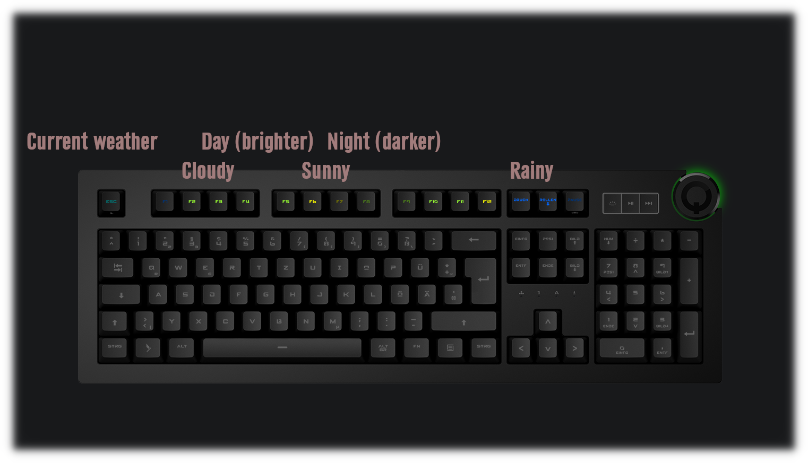

# Q-Weather
Shows the weather for next 40 hours or so on your Das Keyboard 4Q or 5Q

This will work even if your company uses a proxy that the q software doesn't work with.

# How to read
The escape shows the current weather, all keys to the right show the weather for the next hours,
each key is three more hours into the future.

Each color stands for another type of weather, blue is rain, white is snow etc.

# How to install
Put "pythonw /path/to/main.py" in your startup path and create an "api.key"-file with your openWeatherMap.org api-key.

The weather will be refreshed every 10 minutes.

You may need to change the location and type of your keyboard in the python file.
